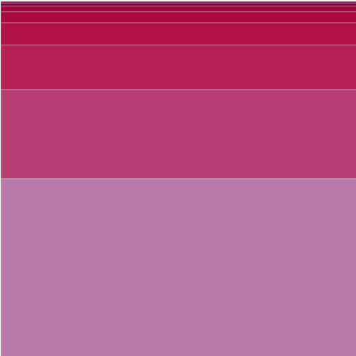
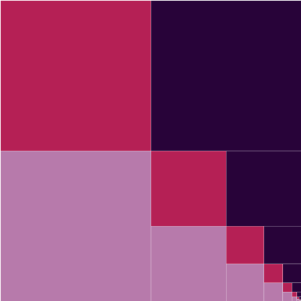

I recently came across a [riddle]:

> There’s a certain country where everybody wants to have a son. Therefore each
> couple keeps having children until they have a boy; then they stop.  What
> fraction of the population is female?

Guess and test
--------------

Delightful!  That's enough information to answer the question?  I'd have
expected more rules.

Maybe the wording "everybody wants to have a son" biased me, but I am pretty
sure that such a country would have more sons than daughters.  But I am also
skeptical of my intuition, since Ellenberg's bread and butter is making you
confident you understand something, and then pulling the rug out from under
you.  He's basically a bully, but we all have Stockholm syndrome.

So let's do some mental napkin math: if there are 100 families in this country.
50 of them will have a boy and no girls.  Another 25 will have one of each.
And there we are: 75 boys to 25 girls, and only 25 families left to consider,
and all of them will have boys too.  It seems difficult for the girls to make a
comeback.  That's the feeling.

Next up, I'd approximate the answer with a calculator.  Since all families have
a boy (it seems like people generally ignore the possibility of families that
have daughters, but haven't yet conceived a son), we can say that there is 1
boy per family.  Look at us.  We're doing math.  Girls are a tiny bit more
complicated.  One quarter of families have one girl, an eighth have two girls,
and so on.

$$ \frac{1}{4} + \frac{2}{8} + \frac{3}{16} + \frac{4}{32} + \frac{5}{64} + \frac{6}{128} + \frac{7}{256} + \frac{8}{512} + \frac{9}{1024} = .99\ \mathrm{girls\ per\ family} $$

Whoa!  They _are_ making a comeback, and we're only 9 terms into this infinite
sum.  I renounce my intuition and would now guess that somehow, the amount of
girls precisely equals the amount of boys in the country.  Well, on average.

But why? How?
-------------

Since we're here, this seems like a reasonable time to stop guessing and
approximating, and "do math".

The amount of boys per family is 1 by definition, but since we're doing math,
and we wouldn't want someone to accidentally understand us -- I mean, how then
would we derive our sense of self-worth? -- let us obfuscate:

$$ \mathrm{boys\ per\ family} = S_{b} = \sum\limits_{n=1}^\infty \frac{1}{2^n} = \frac{1}{2} + \frac{1}{4} + \frac{1}{8} + ... $$

And here comes the magic.  We can multiply every term in the sequence by 2:

$$ 2 \cdot S_{b} = \sum\limits_{n=0}^\infty \frac{1}{2^n} = 1 + \frac{1}{2} + \frac{1}{4} + \frac{1}{8} + ... $$

We can see that the nth element of $S_{b}$ equals the (n+1)th element of
$2 \cdot S_{b}$.

And being a little clever, we eliminate all those pesky infinite terms:

$$ 2 \cdot S_{b} - S_{b} = 1 + \frac{1}{2} - \frac{1}{2} + \frac{1}{4} - \frac{1}{4} + \frac{1}{8} - \frac{1}{8} + ... = 1 $$

$$S_{b} = 1$$

So now we're back where we started, with the added benefit of alienating some
people.  Let's keep going; maybe it'll be useful.

We can use the exact same reasoning as above to get a more general formula for
the sum of an infinite sum:

$$ \sum\limits_{n=0}^\infty x^n = \frac{1}{1-x} $$

> so long as the series converges, it'll converge to this.

Now let's formalize the amount of girls in this country:

$$ \mathrm{girls\ per\ family} = S_{g} = \sum\limits_{n=2}^\infty \frac{n}{2^n} = \frac{1}{4} + \frac{2}{8} + \frac{3}{16} + ... $$

This sum has a slightly different form, so we can't use the general formula we
just came up with.  But, you might notice that $\frac{d}{dx} x^n = n x^{n-1}$,
which _does_ match the form of $S_{g}$.

So let's follow that clue:

$$ \sum\limits_{n=0}^\infty x^n = \frac{1}{1-x} $$
$$ \frac{d}{dx} \sum\limits_{n=0}^\infty x^n = \frac{d}{dx} \frac{1}{1-x} $$
$$ \sum\limits_{n=0}^\infty n x^{n-1} = \frac{1}{(x-1)^2} $$

And shuffling some things around:

$$ S_{g} = 1 $$

So here we are.  We've been good.  We didn't just take formulas from an oracle
and plug things in; we derived them.  I feel confident that the answer is
correct, and that I would get a ✓ if this were math homework.  Still, doing all
this symbol manipulation brings me no intuitive satisfaction as to _why_ or
_how_ those two infinite sequences converge to the same value.

Let's try something less fancy.

But why? How? (Round 2)
-----------------------

Let's try looking at the values of $ f(n) = \frac{n}{2^n} $.  Remember that
$ S_{g} = \sum\limits_{n=2}^\infty \frac{n}{2^n} = \sum\limits_{n=2}^\infty f(n) $

If we think about it, we can show that each term
$ f(n) = \frac{f(n-1)}{2} + \frac{1}{2^n} $

So that's how I'll calculate each line below: take the previous line, divide
by 2, and add the next power of 1/2:

$ f(2) = \frac{1}{4} $
$ f(3) = \frac{1}{8} + \frac{1}{8} = \frac{1}{4} $
$ f(4) = \frac{1}{8} + \frac{1}{16} $
$ f(5) = \frac{1}{16} + \frac{1}{32} + \frac{1}{32} = \frac{1}{8} $
$ f(6) = \frac{1}{16} + \frac{1}{64} $
$ f(7) = \frac{1}{32} + \frac{1}{128} + \frac{1}{128} = \frac{1}{32} + \frac{1}{64} $
$ f(8) = \frac{1}{64} + \frac{1}{128} + \frac{1}{256} $
$ f(9) = \frac{1}{128} + \frac{1}{256} + \frac{1}{512} + \frac{1}{512} = \frac{1}{64} $
$ f(10) = \frac{1}{128} + \frac{1}{1024} $

And now we stare.

Somehow when we sum all the lines together, (in the reduced form) there are
exactly two 1/4s, adding up to 1/2, two 1/8s, adding up to 1/4, two 1/16s, just
one 1/32, but three 1/64s to make up for it.

I see how this is mimicking $\sum\limits_{n=1}^\infty \frac{1}{2^n}$, and I get
another little kick of dopamine from my brain, having somehow connected two
seemingly unconnected things.  But for all that, I just don't see the pattern.
I see that it works, but I don't understand why it must.

But why? How? (Round 3)
-----------------------

Let's just start drawing things?

I began drawing by hand, but quickly ran into the limits of my ability to
draw straight lines.  So, not unlike Donald Knuth, I made [playbox] to generate
the box images below.

### Starting basic

As before, let's calibrate this tool on something relatively simple (population
of boys), before we move on to the more advanced.

Recall that the number of boys per family can be expressed as
$ \sum\limits_{n=1}^\infty \frac{1}{2^n} = \frac{1}{2} + \frac{1}{4} + \frac{1}{8} + ... $
So if we were to draw a square, we could show it filling up by shading in 1/2
of it, then another 1/4, then 1/8, and so on:

Each subsequent box has half the height of the previous, hence half the area.
And still, we see the box filling up to the point that drawing additional boxes
is difficult even with computer assistance.

Here's another equally valid way to visualize
$ \sum\limits_{n=1}^\infty \frac{1}{2^n} $:

Here, we alternating halving the height and then width of the subsequent boxes,
but the effect is the same:  the whole box is filled with color, and we can
wave our hands and claim this means the sum of the series approaches 1.

### Something a teeny bit different

Let's try visualizing an infinite sum that doesn't converge to 1.  That is to
say, something that won't fill the box up all the way:
$ S_{q} = \sum\limits_{n=1}^\infty \frac{1}{4^n} $

Now we'll want each subsequent box to have 1/4 the area of the preceding one.

I'm not totally sure what to make of that, and I think we could make a prettier
visualization.  Let's try:

At this point, I notice that besides being prettier, this second visualization
of our series is a perfect complement to our first one.  Well, almost perfect.
We'd need a third to completely fill up the box.

Each of the three colors in the above image represents our sum
$ S_{q} = \sum\limits_{n=1}^\infty \frac{1}{4^n} $.

And 3 of them fill up the box: $ 3 \cdot S_{q} = 1 $.

Therefore $ S_{q} = \frac{1}{3} $.

My intuition is appeased.  This makes sense.

### Another way

Before we move on, there's another intuitive way to show that
$ S_{q} = \frac{1}{3} $.

Because the images we are using to visualize are self-similar, we can do a
little bit of magic on them.  Notice that the bottom-right quarter of the above
image (and, of each of our other visualizations of $ S_{q} $) has exactly the
same shape as the whole square, just shrunk by a factor of 4.  In fact, we
could refer to the bottom-right quarter as $ \frac{1}{4} S_{q} $.

Once we've done that, we can get rid of all those infinite boxes.  If we
subtract the areas shaded in the bottom-right quarter from the whole square,
the only thing left shaded is the top-right quarter.  Its area is 1/4.

$$ S_{q} - \frac{1}{4} S_{q} = \frac{1}{4} $$
$$ \frac{3}{4} S_{q} = \frac{1}{4} $$
$$ S_{q} = \frac{1}{3} $$

This is a visual representation of the "magic" we performed in the first
[But why? How?](#but-why-how-round-3) section.

### The main event

But enough diversions.  We are here to figure out why / how
$ S_{g} = \sum\limits_{n=2}^\infty \frac{n}{2^n} = \frac{1}{4} + \frac{2}{8} + \frac{3}{16} + ... = 1 $

So let's draw it:

It's pretty.  And it seems to be filling up the box?  Well, except for that
top-right corner.  What's going on there?

The shape doesn't have any obvious complements, so we can't rely on the method
we found in [Something a teeny bit different](#something-a-teeny-bit-different).
But it is self-similar!

Just as in [Another way](#another-way), we can see say that the top-right
quarter of our box is exactly the same as the entire box, just shrunk by a
factor of 4.  And the top-left quarter looks just like
$ \sum\limits_{n=1}^\infty \frac{1}{2^n} $, (which we've already shown to
equal 1) shrunk by a factor of 4.  Miracles!

The bottom-right quarter is exactly the same as the top-left, just rotated 90
degrees clockwise.  The last bottom-left quarter is shaded in completely, so
its area is 1/4.

This should be enough.  Let's obfuscate!

The entire box $ S_{g} $ is made up of 4 quarters:

$$ \mathrm{topleft} = \frac{1}{4}(\sum\limits_{n=1}^\infty \frac{1}{2^n}) $$
$$ \mathrm{topright} = \frac{1}{4} S_{g} $$
$$ \mathrm{bottomleft} = \frac{1}{4} $$
$$ \mathrm{bottomright} = \frac{1}{4}(\sum\limits_{n=1}^\infty \frac{1}{2^n}) $$

And they sum up to $ S_{g} $:

$$ S_{g} = \frac{1}{4} + \frac{1}{4}(\sum\limits_{n=1}^\infty \frac{1}{2^n}) + \frac{1}{4}(\sum\limits_{n=1}^\infty \frac{1}{2^n}) + \frac{1}{4} S_{g} $$
$$ \frac{3}{4} S_{g} = \frac{1}{4} + \frac{1}{2}(\sum\limits_{n=1}^\infty \frac{1}{2^n}) = \frac{3}{4} $$
$$ S_{g} = 1 $$

🎉🎉🎉🎉 We did it!  We drew a picture.  And it turned out to be made of parts
that were either infinite sums whose values we'd already calculated, or itself
shrunken down.

Now I can stare at this picture and say "Well, that quarter is fully shaded, so
I know its value.  These two quarters are clearly converging to filling up each
of their quarters, and this last one is self-similar to the whole square".

I am still delighted by the fact that the amount of girls on-average equals the
amount of boys in that strange country that is unsuccessfully discriminating
against girls.  But now I feel like I kind of understand how it happens.

Epilogue
--------

There's a lot we didn't cover here.  Like why does the top-right corner have so
much more unshaded space than previous visualizations?  Does the answer to this
question [depend](https://mathoverflow.net/a/17963) on the population of the
country?  What about the case where families have conceived girls, but hadn't
gotten to a boy?  (I'd say that the main reason mathematicians find this
[riddle] so contentious is this detail).

But sometimes we have to be content with what is, and not dwell on what isn't.

Thanks for reading!

Thank You
---------
... to [leegao/readme2tex], because github doesn't natively support latex in
readmes.

[riddle]: https://quomodocumque.wordpress.com/2011/01/10/the-google-puzzle-and-the-perils-of-averaging-ratios/
[playbox]: https://github.com/sergeio/playbox
[leegao/readme2tex]: https://github.com/leegao/readme2tex
